# Project Management App – Dare de seamă

## 1. Interfață și Experiența Utilizatorului (UI/UX)
Aplicația oferă o interfață modernă, intuitivă și responsivă, adaptată pentru dispozitive mobile.  
Componentele personalizate (input-uri, butoane, pickere, modale) asigură o experiență coerentă și plăcută pentru utilizator.

## 2. Navigare folosind Expo Router cu Tipuri de Navigatori
Navigarea între ecrane este gestionată cu ajutorul expo-router.  
Sunt folosiți atât Stack Navigators (pentru fluxuri de autentificare sau detalii), cât și Tab Navigators (pentru secțiuni principale ale aplicației).
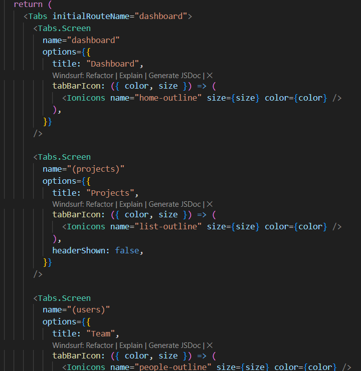  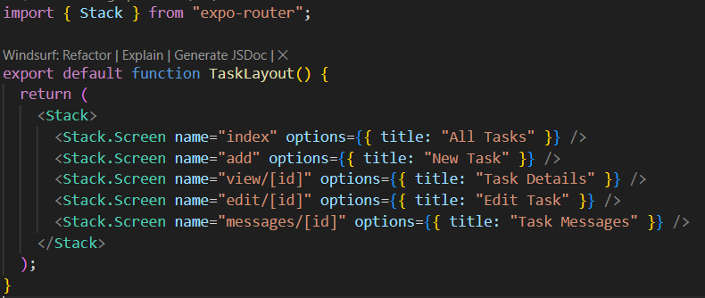

## 3. Gestionarea State-ului (State Management)
State-ul global este gestionat cu ajutorul contextelor React (Context API).  
Exemple: context pentru utilizator (autentificare), context pentru proiecte, context pentru notificări.
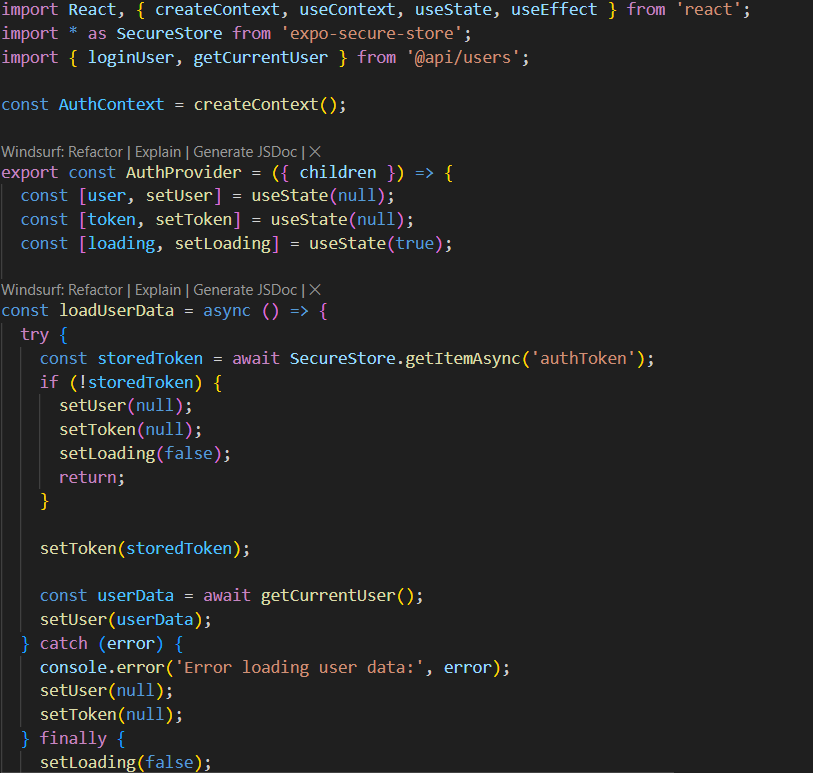

## 4. Formulare și Validare
Toate formularele folosesc react-hook-form pentru gestionarea datelor și a validărilor.  
Validarea datelor este realizată cu ajutorul bibliotecii zod, asigurând reguli stricte și feedback instant utilizatorului.
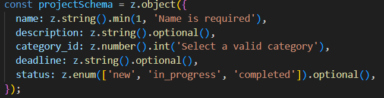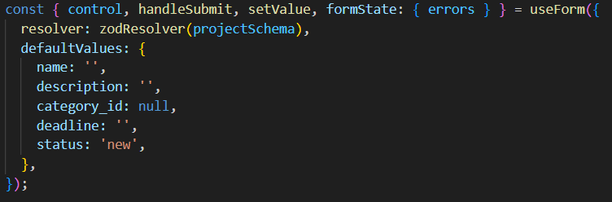

## 5. Networking și Date Asincrone
Pentru comunicarea cu backend-ul, aplicația folosește axios.  
Datele sunt preluate și trimise asincron către un API extern (backend propriu), cu gestionarea erorilor și a stărilor de încărcare.
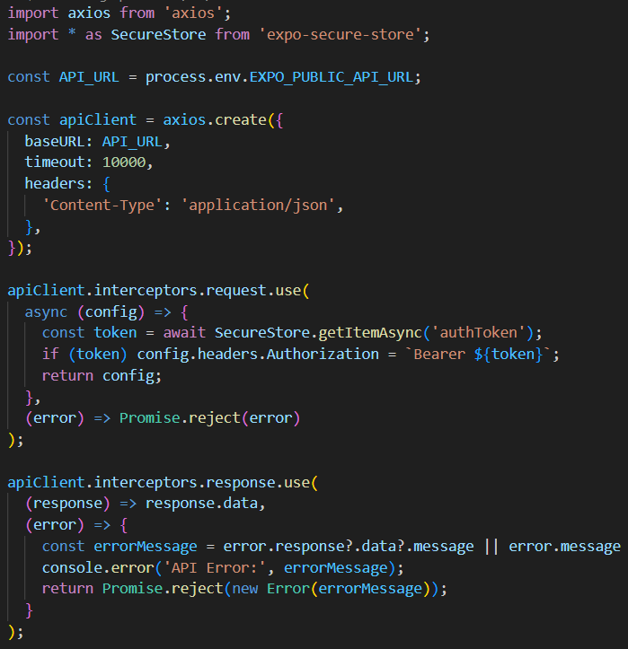

## 6. Stocare Securizată
Tokenul de autentificare este stocat în siguranță folosind expo-secure-store, protejând datele sensibile ale utilizatorului.
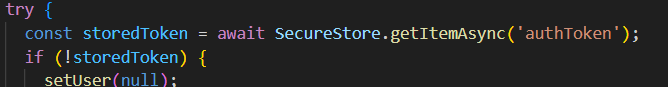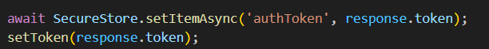

## 7. Utilizarea expo-camera, expo-image-picker, expo-media-library și permisiunile aferente
Utilizatorii pot adăuga imagini sau pot face poze direct din aplicație, folosind expo-camera și expo-image-picker.  
Pentru accesul la galerie și media, este folosit expo-media-library.  
Permisiunile pentru cameră, galerie și media sunt gestionate centralizat, cu feedback clar pentru utilizator în caz de refuz.
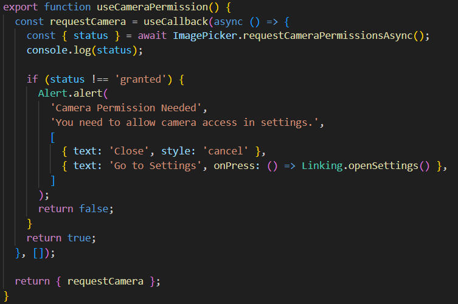 
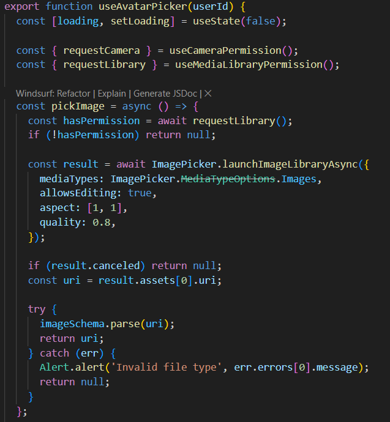
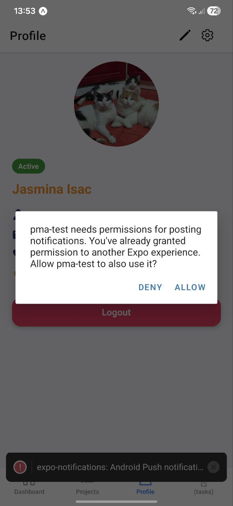
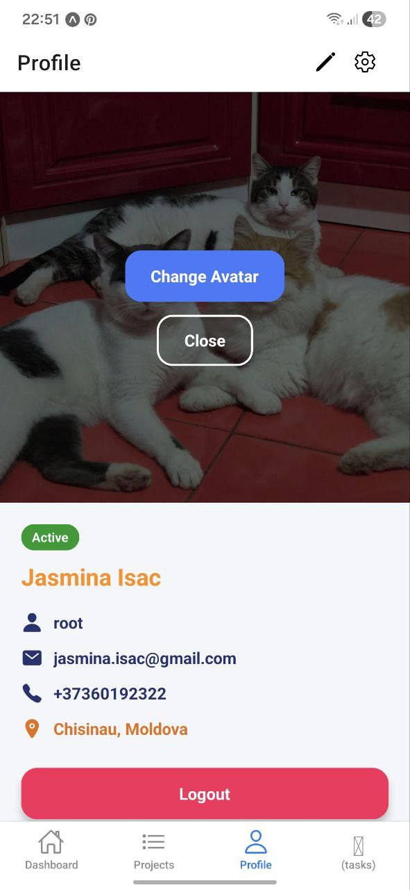

## 8. Notificări Locale cu expo-notifications
Aplicația trimite notificări locale folosind expo-notifications.  
Permisiunile pentru notificări sunt cerute la nevoie, iar notificările pot fi programate sau trimise instant, cu feedback vizual pentru utilizator.

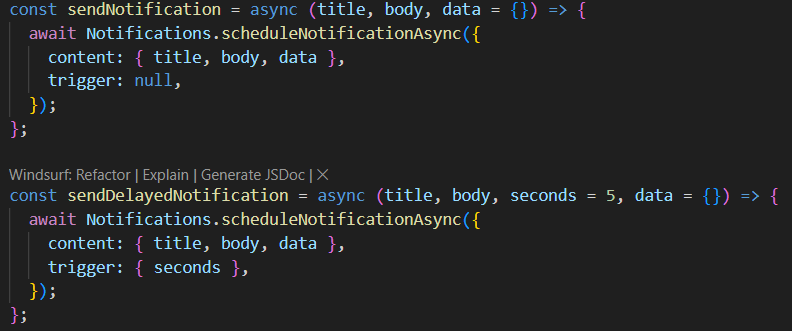
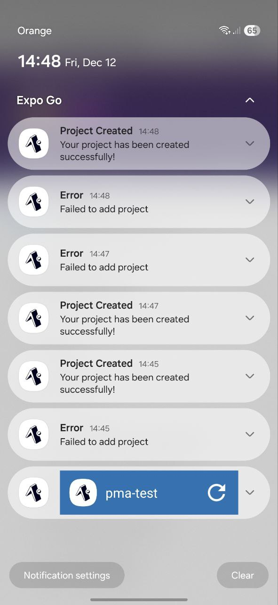

## Vizualul aplicației
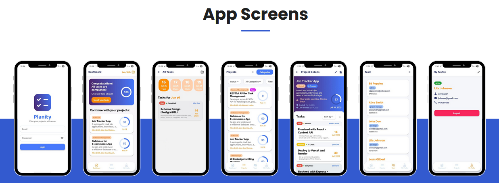